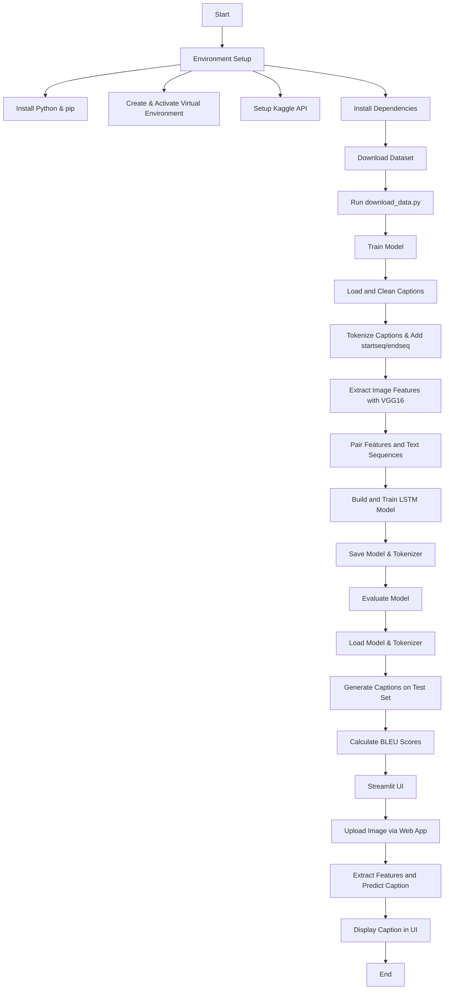

# 📸 Image Captioning Project

This repository contains a deep learning project for generating descriptive captions for images. It leverages a pre-trained VGG16 model for image feature extraction and an LSTM-based recurrent neural network (RNN) for sequence generation (captioning). The project is organized for modularity, allowing easy setup, training, evaluation, and deployment of a user-friendly Streamlit web interface.

---

## 📚 Table of Contents

- [Introduction](#introduction)
- [Features](#features)
- [Project Structure](#project-structure)
- [Workflow Flowchart](#workflow-flowchart)
- [Prerequisites](#prerequisites)

---

## 🧠 Introduction

This project aims to build an image captioning system. It takes an image as input and produces a human-readable sentence describing its content. The solution combines a Convolutional Neural Network (CNN) for image understanding and a Recurrent Neural Network (RNN) with Long Short-Term Memory (LSTM) units for natural language generation.

---

## ✨ Features

- **Modular Codebase**: Organized into logical modules (models, utils, scripts).
- **Data Handling**: Scripts for downloading the Flickr8k dataset via Kaggle API.
- **Text Preprocessing**: Cleaning and tokenizing image captions.
- **Feature Extraction**: Using pre-trained VGG16.
- **Model Training**: LSTM-based sequence-to-sequence caption generator.
- **Model Evaluation**: BLEU scores for evaluation.
- **Interactive UI**: Built with Streamlit for real-time captioning.

---

## 📁 Project Structure
```markdown
image_captioning_project/
├── data/
│   └── (This directory will be created by Kaggle API for downloaded dataset)
├── models/
│   ├── __init__.py
│   ├── vgg16_model.py          # Defines the VGG16 feature extractor.
│   └── captioning_model.py     # Defines the LSTM-based captioning model.
│   └── image_captioning_model.keras # Trained captioning model (generated after training).
│   └── tokenizer.json          # Trained text tokenizer (generated after training).
├── utils/
│   ├── __init__.py
│   ├── data_preprocessing.py   # Functions for image feature extraction, tokenization, data splitting.
│   ├── text_cleaning.py        # Functions for cleaning raw text captions.
│   └── visualization.py        # Plotting functions for data exploration and training history.
├── scripts/
│   ├── download_data.py        # Script to download the Flickr8k dataset.
│   ├── train_model.py          # Script to train the image captioning model.
│   ├── evaluate_model.py       # Script to evaluate the trained model using BLEU score.
│   └── predict_caption.py      # Standalone script to predict captions for sample images.
├── app.py                      # Streamlit web application for interactive image captioning.
├── main.py                     # Orchestrates the entire workflow (download, train, evaluate, predict).
└── requirements.txt            # Lists all Python dependencies.
└── README.md                   # This file.
```
---

## Workflow Flowchart


---
## ✅ Prerequisites

Before you begin, make sure you have the following installed:

- Python 3.8 or above
- pip (Python package manager)
- A Kaggle account (for dataset download)
- Git (for cloning the repository)
---
