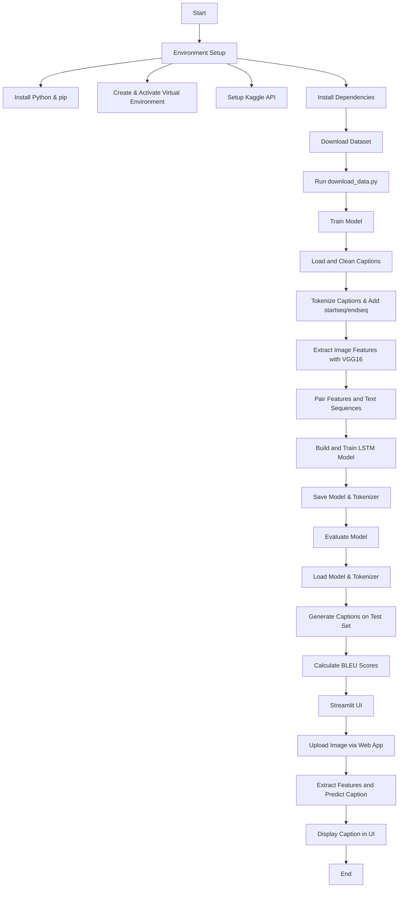

# 📸 Image Captioning Project

This repository contains a deep learning project for generating descriptive captions for images. It leverages a pre-trained VGG16 model for image feature extraction and an LSTM-based recurrent neural network (RNN) for sequence generation (captioning). The project is organized for modularity, allowing easy setup, training, evaluation, and deployment of a user-friendly Streamlit web interface.

---

## 📚 Table of Contents

- [Introduction](#introduction)
- [Features](#features)
- [Project Structure](#project-structure)
- [Workflow Flowchart](#workflow-flowchart)
- [Prerequisites](#prerequisites)

---

## 🧠 Introduction

This project aims to build an image captioning system. It takes an image as input and produces a human-readable sentence describing its content. The solution combines a Convolutional Neural Network (CNN) for image understanding and a Recurrent Neural Network (RNN) with Long Short-Term Memory (LSTM) units for natural language generation.

---

## ✨ Features

- **Modular Codebase**: Organized into logical modules (models, utils, scripts).
- **Data Handling**: Scripts for downloading the Flickr8k dataset via Kaggle API.
- **Text Preprocessing**: Cleaning and tokenizing image captions.
- **Feature Extraction**: Using pre-trained VGG16.
- **Model Training**: LSTM-based sequence-to-sequence caption generator.
- **Model Evaluation**: BLEU scores for evaluation.
- **Interactive UI**: Built with Streamlit for real-time captioning.

---

## 📁 Project Structure
```markdown
image_captioning_project/
├── data/
│   └── (This directory will be created by Kaggle API for downloaded dataset)
├── models/
│   ├── __init__.py
│   ├── vgg16_model.py          # Defines the VGG16 feature extractor.
│   └── captioning_model.py     # Defines the LSTM-based captioning model.
│   └── image_captioning_model.keras # Trained captioning model (generated after training).
│   └── tokenizer.json          # Trained text tokenizer (generated after training).
├── utils/
│   ├── __init__.py
│   ├── data_preprocessing.py   # Functions for image feature extraction, tokenization, data splitting.
│   ├── text_cleaning.py        # Functions for cleaning raw text captions.
│   └── visualization.py        # Plotting functions for data exploration and training history.
├── scripts/
│   ├── download_data.py        # Script to download the Flickr8k dataset.
│   ├── train_model.py          # Script to train the image captioning model.
│   ├── evaluate_model.py       # Script to evaluate the trained model using BLEU score.
│   └── predict_caption.py      # Standalone script to predict captions for sample images.
├── app.py                      # Streamlit web application for interactive image captioning.
├── main.py                     # Orchestrates the entire workflow (download, train, evaluate, predict).
└── requirements.txt            # Lists all Python dependencies.
└── README.md                   # This file.
```
---

## Workflow Flowchart


---
## ✅ Prerequisites

Before you begin, make sure you have the following installed:

- Python 3.8 or above
- pip (Python package manager)
- A Kaggle account (for dataset download)
- Git (for cloning the repository)
---
## Project Structure and Execution Sequence

This project is organized into several folders, each serving a specific purpose in the image captioning pipeline. Understanding their roles and the recommended execution sequence is key to running the project successfully.

### Folder Roles

* **`data/`**:
    * **Role**: This folder is intended to store the raw dataset. It is primarily managed by the Kaggle API.
    * **Content**: After executing `scripts/download_data.py`, the Flickr8k dataset will be downloaded and placed here (or in Kaggle's default cache location, which `scripts/download_data.py` will point to). It contains the image files and the text caption files.
* **`models/`**:
    * **Role**: This folder contains the definitions of the neural network architectures and stores the trained model artifacts.
    * **Content**:
        * `captioning_model.py`: Defines the architecture of the LSTM-based image captioning model.
        * `vgg16_model.py`: Defines how the pre-trained VGG16 model is loaded and adapted for feature extraction.
        * `image_captioning_model.keras` (generated): The saved weights and architecture of the trained image captioning model after `train_model.py` is run.
        * `tokenizer.json` (generated): The saved vocabulary tokenizer, mapping words to numerical IDs, generated after `train_model.py` is run.
* **`scripts/`**:
    * **Role**: This folder houses the executable Python scripts that perform core operations of the project.
    * **Content**:
        * `download_data.py`: Handles the programmatic download of the Flickr8k dataset from Kaggle.
        * `evaluate_model.py`: Performs evaluation of the trained captioning model on a test set, typically calculating metrics like BLEU score.
        * `predicts_caption.py`: A standalone script to demonstrate caption prediction for specific images (useful for quick tests outside the Streamlit app).
        * `train_model.py`: Orchestrates the data loading, preprocessing, model building, and training phases of the image captioning model.
* **`utils/`**:
    * **Role**: This folder contains helper functions and utility modules that are used across different scripts and models.
    * **Content**:
        * `data_preprocessing.py`: Includes functions for tasks like extracting image features using VGG16, tokenizing text, and splitting datasets into training, validation, and test sets.
        * `text_cleaning.py`: Contains functions specifically for cleaning and normalizing the raw text captions (e.g., removing punctuation, single characters, or numeric words).
        * `visualization.py`: Provides functions for generating various plots, such as word frequency histograms, PCA embeddings, training history (loss plots), and displaying evaluation results.
* **`app.py`**:
    * **Role**: This is the main entry point for the Streamlit web application. It provides an interactive user interface for image captioning.
    * **Content**: It loads the trained models and tokenizer, allows users to upload images, displays the images, and shows the AI-generated captions.
* **`main.py`**:
    * **Role**: This script acts as an orchestrator, chaining together the execution of other scripts to run the entire workflow end-to-end.
    * **Content**: It calls `download_data.py`, `train_model.py`, `evaluate_model.py`, and `app.py` (via `streamlit run`) in sequence.
* **`requirements.txt`**:
    * **Role**: Lists all the Python libraries and their versions required for the project to run correctly.
    * **Content**: Used by `pip` to install dependencies.
* **`README.md`**:
    * **Role**: The primary documentation file for the project, providing an overview, setup instructions, usage guide, and other relevant information.
    * **Content**: This file itself.

### Execution Sequence

To successfully run this image captioning project, follow these steps in the specified order:

1.  **Initial Setup and Dependencies:**
    * Ensure all [Prerequisites](#prerequisites) are met.
    * Clone the repository and navigate into its directory.
    * Set up and activate your Python [Virtual Environment](#setting-up-python-virtual-environment).
    * Configure your [Kaggle API Key](#kaggle-api-setup).
    * Install all project [Dependencies](#installing-dependencies) using `requirements.txt` and download `nltk` data.

2.  **Download Dataset:**
    * Run `scripts/download_data.py`. This script will fetch the Flickr8k dataset, which is essential for training and evaluation.
    ```bash
    python scripts/download_data.py
    ```

3.  **Train Model:**
    * Run `scripts/train_model.py`. This is the most computationally intensive step. It will preprocess the data, build the neural network, train it on the dataset, and save the trained model (`image_captioning_model.keras`) and the tokenizer (`tokenizer.json`) in the `models/` directory. These saved files are critical for subsequent steps.
    ```bash
    python scripts/train_model.py
    ```

4.  **Evaluate Model:**
    * (Optional, but Recommended for performance check) Run `scripts/evaluate_model.py`. This script will load the saved model and tokenizer, evaluate its performance on a held-out test set, and provide metrics like the BLEU score.
    ```bash
    python scripts/evaluate_model.py
    ```

5.  **Run Streamlit UI (Interactive Web Application):**
    * Run `app.py` using Streamlit. This will launch a local web server and open the interactive image captioning application in your browser. You can then upload images and get captions.
    ```bash
    streamlit run app.py
    ```

**(Alternative) Run Main Orchestration Script:**
You can run the entire sequence (download, train, evaluate, and launch Streamlit UI) using `main.py`. This is convenient but note that `train_model.py` can take a long time, and `main.py` will wait for it to complete.

```bash
python main.py
```